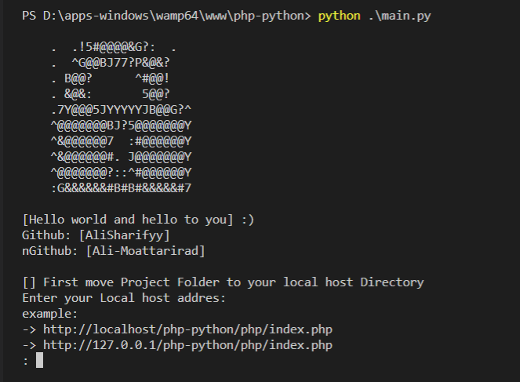
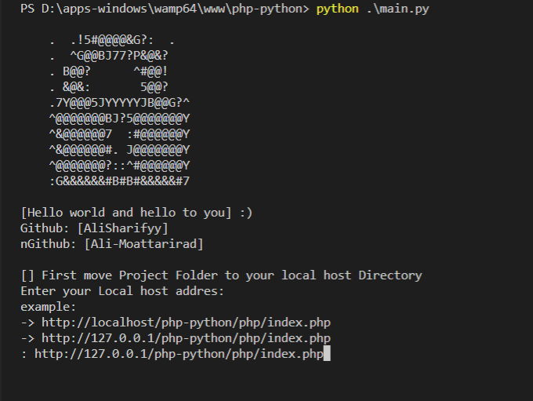
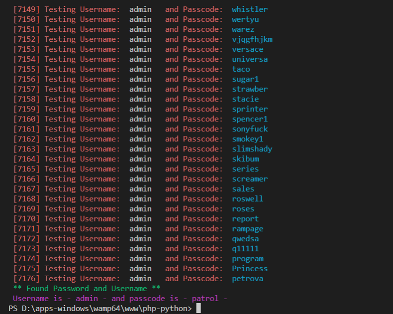
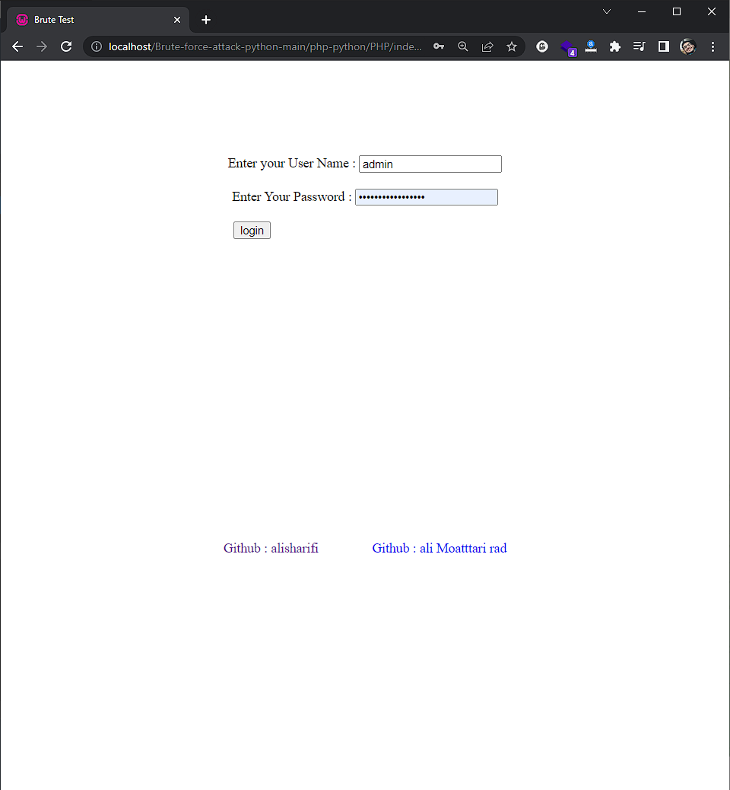
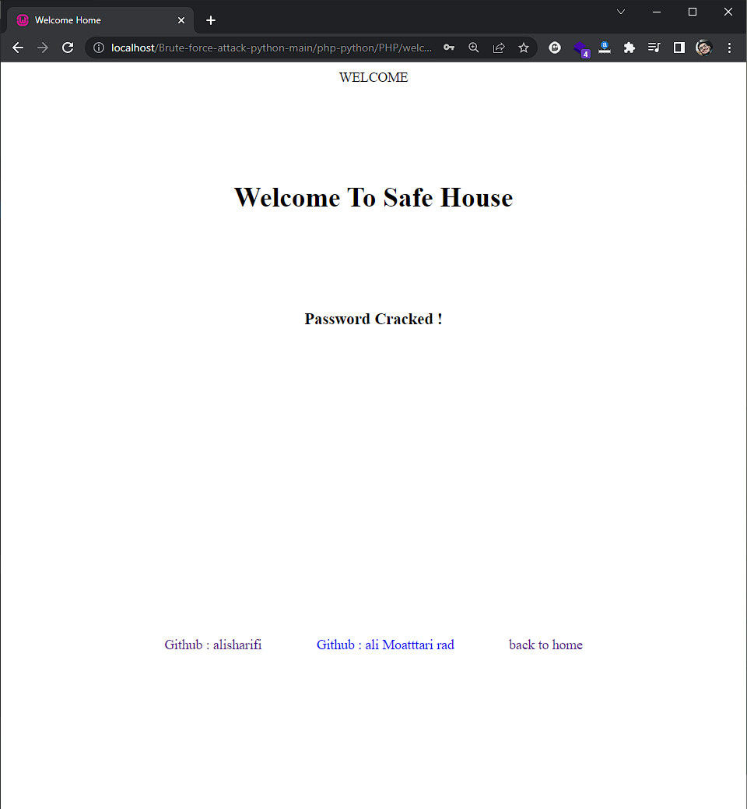

# [Brute-force-attack](https://en.wikipedia.org/wiki/Brute-force_attack)-python
## implementation of a simple Brute-force attack in python
### using requests library

 

---
## who involved in this project:

> Python Side : [Ali-Sharify](https://github.com/alisharifyy)
> php side : [ali-rad](https://github.com/Ali-Moattarirad)

---
<h1>Requirement Library</h1>

> 
 colorama 
 
> 
 requests 

## How to install :
- [pip install colorama](https://pypi.org/project/colorama/) 
 pip3 install colorama OR conda install -c anaconda colorama 
- [pip install requests](https://pypi.org/project/requests/) 
 python -m pip install requests

---

> # images :

# step 1
- Run Program Via Terminal
- Be Sure Your Local Host App Like Wamp Or ... Is On

 

# step 2

 

# step 3

---
 

# **web interface :**

- Be Sure Your Local Host App Like Wamp Or Xampp ... Is On
- Then in Url bar type : localhost/PROJECT-FOLDER-NAME

## login page

## Safe Page

## Error Page

